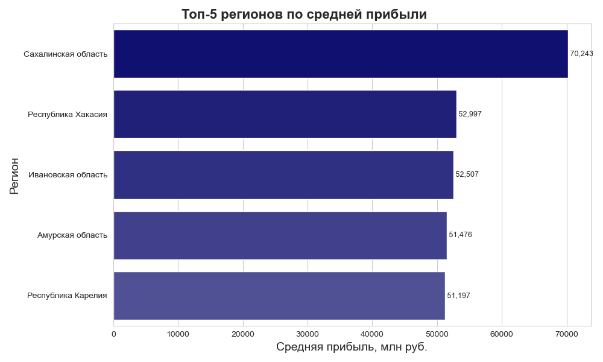
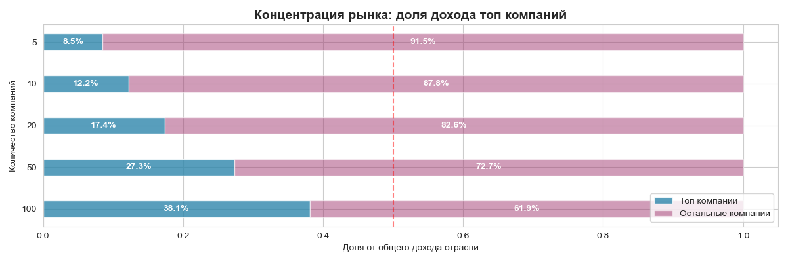

# BuildData-Analytics

Этот репозиторий представляет собой проект исследованию строительной отрасли России на основе данных [Федеральной налоговой службы](https://bo.nalog.gov.ru/). Проект включает сбор данных о компаниях, расчет финансовых метрик, геопространственный анализ и проверку бизнес-гипотез.

**Ключевые вопросы исследования:**
- Насколько перспективна строительная отрасль в целом?
- Какие регионы лидируют по объемам полученной прибыли?
- Существует ли монополия на рынке строительных компаний в России?

## Запуск проекта

Для запуска нужно:
1. Клонировать репозиторий:

`git clone https://github.com/yourusername/construction-industry-analysis.git`

3. Последовательно запутить следующие файлы:

   - links_parser.ipynb
   - data_parser.ipynb
   - etl+calculations.ipynb
   - maps_and_graphics.ipynb

Все полученные в результате парсинга данные будут храниться в папке `/data/`, а все полученные графики в `/graphics/`.

## Полученные результаты

### Общие тенденции темпов роста прибыли

Первым этапом анализа стало изучение общей тенденции темпов роста прибыли компаний. Распределение компаний по данному показателю имеет ярко выраженную левостороннюю асимметрию, что свидетельствует о системном кризисе в отрасли. Катастрофическое падение прибыли более чем на сто процентов продемонстрировали большинство компаний в стране, что означает не просто убыточность, а полную потерю капитала относительно 2023 года. Эти компании находятся в зоне высокого риска банкротства. В зоне роста, то есть с показателями выше нуля, оказалось всего 110 компаний, что составляет менее 2.5% от общего числа. 

### Анализ лидеров отрасли

Вторым этапом исследования стал анализ компаний, работающих в плюс либо в небольшой убыток. Для этого были отобраны топ пятьсот компаний по прибыли и нанесены на карту России. На карте отчетливо видна высокая централизация прибыльных компаний. Наблюдается плотное скопление точек в Московском регионе, что указывает на локализацию штаб-квартир крупнейших строительных холдингов. Вторым по значимости кластером является Санкт-Петербург и Ленинградская область. Также выделяются нефтегазовые регионы, включая Ханты-Мансийский автономный округ, Ямало-Ненецкий автономный округ и Татарстан, где точки высокой прибыли связаны с промышленным строительством. В Краснодарском крае сформировался кластер, связанный с курортным и жилым строительством. Кроме того, наблюдаются разрозненные точки в Сибири и на Дальнем Востоке, представляющие собой локальных лидеров, часто связанных с государственными заказами или добывающей промышленностью. Важное наблюдение заключается в том, что компании, работающие в плюс или небольшой минус, географически привязаны к регионам с высокой экономической активностью или наличием федеральных бюджетов, тогда как периферия представлена слабо.

Также в результате работы был составлен рейтинг пяти лучших регионов по средней прибыли, который выявил неожиданных лидеров:

Первое место занимает Сахалинская область. Такое лидерство может объясняется строительством большого количества вахтовых городков и инфраструктуры для добычи сжиженного природного газа. На втором месте находится Республика Хакасия, где высокие прибыли скорее связаны с крупными угольными разрезами и строительством под потребности энергетики и РЖД. Третье место занимает Ивановская область. Данный результат выглядит аномальным и, вероятно, объясняется эффектом одной крупной компании, то есть федерального игрока, зарегистрированного в регионе. Четвертое место у Амурской области, где драйверами роста выступают космодром Восточный и газоперерабатывающий завод, представляющие собой гигапроекты Газпрома. Замыкает пятерку лидеров Республика Карелия с показателем пятьдесят один миллион сто девяносто семь тысяч рублей, где высокая средняя прибыль может быть связана с деятельностью целлюлозно-бумажных комбинатов и развитием туристической инфраструктуры. 
Отсутствие Москвы, Санкт-Петербурга и других богатых регионов в данном рейтинге объясняется эффектом масштаба, поскольку в них зарегистрировано огромное количество компаний, включая мелкие и средние, которые снижают средний показатель, несмотря на наличие гигантов. 

### Анализ монополизации рынка

Четвертым этапом стала проверка наличия монополии на рынке. Для этого был рассчитан коэффициент концентрации, показывающий, сколько процентов прибыли от общей получают первые пять, десять, двадцать, пятьдесят и сто компаний:

Полученные показатели свидетельствуют о низкоконцентрированном рынке с чертами монополистической конкуренции. Рынок фрагментирован, игроков много, но при этом, как было показано на первом графике, почти все они убыточны. Это классический признак рынка совершенной конкуренции в фазе кризиса, когда барьеры входа низкие, игроков много, а маржинальность стремится к нулю или отрицательным значениям.

## Полученные выводы

На основе проведенного анализа можно сформулировать следующие итоговые выводы. Строительная отрасль находится в кризисном состоянии, поскольку более девяноста семи процентов компаний демонстрируют падение прибыли в две тысячи двадцать четвертом году. Отрасль переживает фазу сжатия и чистки рынка от слабых игроков. Несмотря на общий кризис, существуют анклавы прибыльности, которые локализованы географически в регионах с государственными инвестициями и отраслево в сферах инфраструктуры, топливно-энергетического комплекса и специальных проектов. Лидерами по средней прибыли стали регионы с крупными инвестиционными проектами федерального значения, а также регионы-аномалии, где высокая средняя прибыль обусловлена регистрацией одного-двух крупных федеральных холдингов. Рыночная структура характеризуется как конкурентная и фрагментированная, при этом топ сто компаний контролируют лишь тридцать восемь процентов прибыли, что говорит о низких барьерах входа, но и о низкой устойчивости бизнеса в кризис.

### Стек технологий

Сбор данных: selenium, pandas
Анализ: numpy
Визуализация: matplotlib, seaborn
Инфраструктура: jupyter, git

### Автор

**Баранов Георгий**

- Email: obraztsovsky@yandex.ru
- Телеграм: [@obraztsovsky](http://t.me/obraztsovsky)
