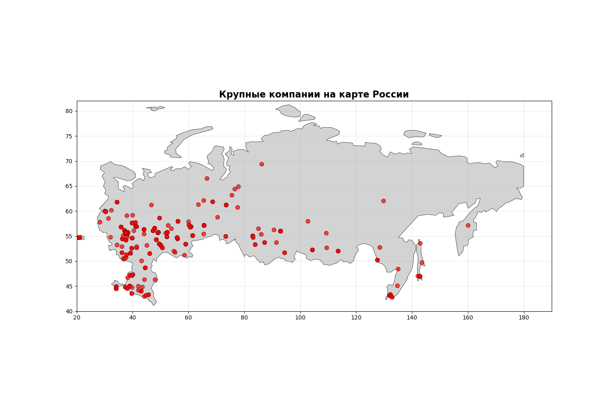

# BuildData-Analytics
Этот репозиторий представляет собой проект исследованию строительной отрасли России на основе данных [Федеральной налоговой службы](https://bo.nalog.gov.ru/). Проект включает сбор данных о компаниях, расчет финансовых метрик, геопространственный анализ и проверку бизнес-гипотез.

**Ключевые вопросы исследования:**
- Насколько перспективна строительная отрасль в целом?
- Какие регионы лидируют по объемам полученной прибыли?
- Существует ли монополия на рынке строительных компаний в России?

## Запуск проекта
Для запуска нужно:
1. Клонировать репозиторий:

`git clone https://github.com/yourusername/construction-industry-analysis.git`

3. Последовательно запутить следующие файлы:

   * links_parser.ipynb
   * data_parser.ipynb
   * etl+calculations.ipynb
   * maps_and_graphics.ipynb

Все полученные в результате парсинга данные будут храниться в папке `/data/`, а все полученные графики в `/graphics/`.

## Полученные результаты
### Общие тенденции темпов роста прибыли
Первым этапом анализа стало изучение общей тенденции темпов роста прибыли компаний. Распределение компаний по данному показателю имеет ярко выраженную левостороннюю асимметрию, что свидетельствует о системном кризисе в отрасли. Катастрофическое падение прибыли более чем на сто процентов продемонстрировали большинство компаний в стране, что означает не просто убыточность, а полную потерю капитала относительно 2023 года. Эти компании находятся в зоне высокого риска банкротства. В зоне роста, то есть с показателями выше нуля, оказалось всего 110 компаний, что составляет менее 2.5% от общего числа. 

##Анализ лидеров отрасли
Вторым этапом исследования стал анализ компаний, работающих в плюс либо в небольшой убыток. Для этого были отобраны топ пятьсот компаний по прибыли и нанесены на карту России. На карте отчетливо видна высокая централизация прибыльных компаний. Наблюдается плотное скопление точек в Московском регионе, что указывает на локализацию штаб-квартир крупнейших строительных холдингов. Вторым по значимости кластером является Санкт-Петербург и Ленинградская область. Также выделяются нефтегазовые регионы, включая Ханты-Мансийский автономный округ, Ямало-Ненецкий автономный округ и Татарстан, где точки высокой прибыли связаны с промышленным строительством. В Краснодарском крае сформировался кластер, связанный с курортным и жилым строительством. Кроме того, наблюдаются разрозненные точки в Сибири и на Дальнем Востоке, представляющие собой локальных лидеров, часто связанных с государственными заказами или добывающей промышленностью. Важное наблюдение заключается в том, что компании, работающие в плюс или небольшой минус, географически привязаны к регионам с высокой экономической активностью или наличием федеральных бюджетов, тогда как периферия представлена слабо.

